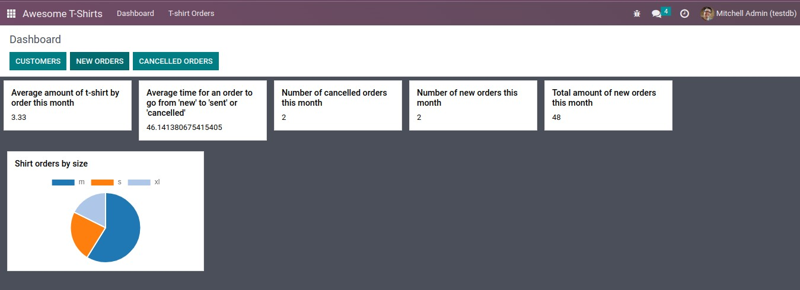
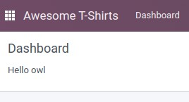
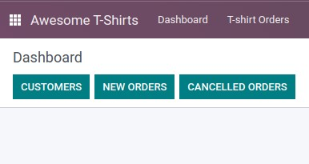
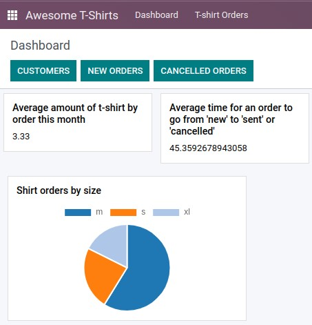
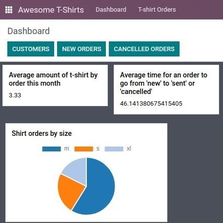

# Part 2: Odoo web Framework

We will now learn to use the Odoo javascript framework. In this module, we will
improve our Awesome dashboard. This will be a good opportunity to discover many useful features.

## 2.1 A new Layout

Most screens in the Odoo web client uses a common layout: a control panel on top,
with some buttons, and a main content zone just below. This is done using a
`Layout` component, available in `@web/search/layout`.

- update the `AwesomeDashboard` component to use the `Layout` component

Note that the `Layout` component has been primarily designed with the current
views in mind. It is kind of awkward to use in another context, so it is highly
suggested to have a look at how it is done in the link provided in resources.

  
<b>Preview</b>

  
<b>Resources</b>

- [example: use of Layout in client action](https://github.com/odoo/odoo/blob/16d55910c151daafa00338c26298d28463254a55/addons/web/static/src/webclient/actions/reports/report_action.js) and [template](https://github.com/odoo/odoo/blob/16d55910c151daafa00338c26298d28463254a55/addons/web/static/src/webclient/actions/reports/report_action.xml)
- [example: use of Layout in kanban view](https://github.com/odoo/odoo/blob/16d55910c151daafa00338c26298d28463254a55/addons/web/static/src/views/kanban/kanban_controller.xml)
- [code: Layout component](https://github.com/odoo/odoo/blob/16d55910c151daafa00338c26298d28463254a55/addons/web/static/src/search/layout.js)

## 2.2 Add some buttons for quick navigation

Bafien Ckinpaers want buttons for easy access to common views in Odoo. Let us
add three buttons in the control panel bottom left zone:

- a button `Customers`, which opens a kanban view with all customers (this action already exists, so you should use its xml id)
- a button `New Orders`, which opens a list view with all orders created in the last 7 days
- a button `Cancelled Order`, which opens a list of all orders created in the last 7 days, but already cancelled

  
<b>Preview</b>

  
<b>Resources</b>

- [odoo: page on services](https://www.odoo.com/documentation/master/developer/reference/frontend/services.html)
- [example: doaction use](https://github.com/odoo/odoo/blob/16d55910c151daafa00338c26298d28463254a55/addons/account/static/src/components/journal_dashboard_activity/journal_dashboard_activity.js#L35)
- [data: action displaying res.partner](https://github.com/odoo/odoo/blob/16d55910c151daafa00338c26298d28463254a55/odoo/addons/base/views/res_partner_views.xml#L511)
- [code: action service](https://github.com/odoo/odoo/blob/16d55910c151daafa00338c26298d28463254a55/addons/web/static/src/webclient/actions/action_service.js#L1456)

## 2.3 Call the server, add some statistics

Let's improve the dashboard by adding a few cards (see the `Card` component
made in the Owl training) containing a few statistics. There is a route
`/awesome_tshirt/statistics` that will perform some computations and return an
object containing some useful informations.

- change `Dashboard` so that it uses the `rpc` service
- call the statistics route in the `onWillStart` hook
- display a few cards in the dashboard containing:
  - number of new orders this month
  - total amount of new orders this month
  - average amount of t-shirt by order this month
  - number of cancelled orders this month
  - average time for an order to go from 'new' to 'sent' or 'cancelled'

  
<b>Preview</b>

  
<b>Resources</b>

- [odoo: rpc service](https://www.odoo.com/documentation/master/developer/reference/frontend/services.html#rpc-service)
- [code: rpc service](https://github.com/odoo/odoo/blob/master/addons/web/static/src/core/network/rpc_service.js)
- [example: calling a route in willStart](https://github.com/odoo/odoo/blob/16d55910c151daafa00338c26298d28463254a55/addons/lunch/static/src/views/search_model.js#L21)

## 2.4 Cache network calls, create a service

If you open your browser dev tools, in the network tabs, you will probably see
that the call to `/awesome_tshirt/statistics` is done every time the client
action is displayed. This is because the `onWillStart` hook is called each
time the `Dashboard` component is mounted. But in this case, we probably would
prefer to do it only the first time, so we actually need to maintain some state
outside of the `Dashboard` component. This is a nice use case for a service!

- implements a new `awesome_tshirt.statistics` service
- it should provide a function `loadStatistics` that, once called, performs the
  actual rpc, and always return the same information
- maybe use the `memoize` utility function from `@web/core/utils/functions`
- use it in the `Dashboard` component
- check that it works as expected

  
<b>Resources</b>

- [example: simple service](https://github.com/odoo/odoo/blob/16d55910c151daafa00338c26298d28463254a55/addons/web/static/src/core/network/http_service.js)
- [example: service with a dependency](https://github.com/odoo/odoo/blob/baecd946a09b5744f9cb60318563a9720c5475f9/addons/web/static/src/core/user_service.js)
- [code: memoize function](https://github.com/odoo/odoo/blob/16d55910c151daafa00338c26298d28463254a55/addons/web/static/src/core/utils/functions.js#L11)

## 2.5 Display a pie chart

Everyone likes charts (!), so let us add a pie chart in our dashboard, which
displays the proportions of t-shirts sold for each size: S/M/L/XL/XXL

For this exercise, we will use Chart.js. It is the chart library used by the
graph view. However, it is not loaded by default, so we will need to either add
it to our assets bundle, or lazy load it (usually better, since our users will not have
to load the chartjs code every time if they don't need it).

- load chartjs
- in a `Card` (from previous exercises), display a pie chart in the dashboard that displays the correct quantity for each
  sold tshirts in each size (that information is available in the statistics route)

  
<b>Preview</b>

  
<b>Resources</b>

- [Chart.js website](https://www.chartjs.org/)
- [Chart.js documentation on pie chart](https://www.chartjs.org/docs/latest/samples/other-charts/pie.html)
- [example: lazy loading a js file](https://github.com/odoo/odoo/blob/16d55910c151daafa00338c26298d28463254a55/addons/web/static/src/views/graph/graph_renderer.js#L53)
- [code: loadJs function](https://github.com/odoo/odoo/blob/16d55910c151daafa00338c26298d28463254a55/addons/web/static/src/core/assets.js#L23)
- [example: rendering a chart in a component](https://github.com/odoo/odoo/blob/3eb1660e7bee4c5b2fe63f82daad5f4acbea2dd2/addons/web/static/src/views/graph/graph_renderer.js#L630)

## 2.6 Misc

Here is a list of some small improvements you could try to do if you have the
time:

- make sure your application can be translated (with `env._t`)
- clicking on a section of the pie chart should open a list view of all orders
  which have the corresponding size
- add a scss file and see if you can change the background color of the dashboard action

  
<b>Preview</b>

  
<b>Resources</b>

- [odoo: translating modules (slightly outdated)](https://www.odoo.com/documentation/master/developer/howtos/translations.html)
- [example: use of env.\_t function](https://github.com/odoo/odoo/blob/16d55910c151daafa00338c26298d28463254a55/addons/account/static/src/components/bills_upload/bills_upload.js#L64)
- [code: translation code in web/](https://github.com/odoo/odoo/blob/16d55910c151daafa00338c26298d28463254a55/addons/web/static/src/core/l10n/translation.js#L16)

