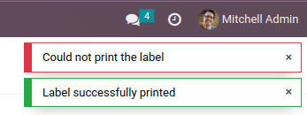
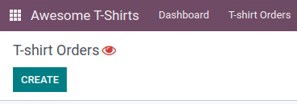

# Part 4: Miscenalleous tasks


## 4.1 Interacting with the notification system

Note: this task depends on the previous exercise.

After using the `Print Label` for some t-shirt tasks, it is apparent that there
should be some feedback that the `print_label` action is completed (or failed,
for example, the printer is not connected or ran out of paper).

- display a notification message when the action is completed succesfully, and a
  warning if it failed
- if it failed, the notification should be permanent.

<details>
  <summary><b>Preview</b></summary>



</details>

<details>
  <summary><b>Resources</b></summary>

- [odoo: notification service](https://www.odoo.com/documentation/master/developer/reference/frontend/services.html#notification-service)
- [example of code using the notification service](https://github.com/odoo/odoo/blob/f7b8f07501315233c8208e99b311935815039a3a/addons/web/static/src/views/fields/image_url/image_url_field.js)

</details>

## 4.2 Add a systray item

Our beloved leader want to keep a close eyes on new orders. He want to see
the number of new, unprocessed orders at all time. Let's do that with a systray
item.

- create a systray component that connects to the statistics service we made
  previously
- use it to display the number of new orders
- clicking on it should open a list view with all of these orders
- bonus point: avoid doing the initial rpc by adding the information to the
  session info

<details>
  <summary><b>Preview</b></summary>


</details>

<details>
  <summary><b>Resources</b></summary>

- [odoo: systray registry](https://www.odoo.com/documentation/master/developer/reference/frontend/registries.html#systray-registry)
- [example: systray item](https://github.com/odoo/odoo/blob/cbdea4010ede6203f5f49d08d5a3bc44f2ff89e8/addons/web/static/src/webclient/user_menu/user_menu.js)
- [example: adding some information to the "session info"](https://github.com/odoo/odoo/blob/cbdea4010ede6203f5f49d08d5a3bc44f2ff89e8/addons/barcodes/models/ir_http.py)
- [example: reading the session information](https://github.com/odoo/odoo/blob/cbdea4010ede6203f5f49d08d5a3bc44f2ff89e8/addons/barcodes/static/src/barcode_service.js#L5)

</details>

## 4.3 Real life update

So far, the systray item from above does not update unless the user refreshes
the browser. Let us do that by calling periodically (for example, every minute)
the server to reload the information

- modify the systray item code to get its data from the tshirt service
- the tshirt service should periodically reload its data

Now the question arises: how is the systray item notified that it should rerender
itself? It can be done in various ways, but for this training, we will chose to
use the most _declarative_ approach:

- modify the tshirt service to return a reactive object (see resources). Reloading
  data should update the reactive object in place
- the systray item can then perform a `useState` on the service return value
- this is not really necessary, but you can also _package_ the calls to `useService` and `useState` in a custom hook `useStatistics`

<details>
  <summary><b>Resources</b></summary>

- [owl: page on reactivity](https://github.com/odoo/owl/blob/master/doc/reference/reactivity.md)
- [owl: documentation on `reactive`](https://github.com/odoo/owl/blob/master/doc/reference/reactivity.md#reactive)
- [example: use of reactive in a service](https://github.com/odoo/odoo/blob/3eb1660e7bee4c5b2fe63f82daad5f4acbea2dd2/addons/web/static/src/core/debug/profiling/profiling_service.js#L30)

</details>

## 4.4 Add a command to the command palette

Now, let us see how we can interact with the command palette. Our staff sometimes
need to work on the image from a tshirt order. Let us modify the image preview
field (from a previous exercise) to add a command to the command palette to
open the image in a new browser tab (or window)

Make sure that the command is only active whenever a field preview is visible
in the screen.

<details>
  <summary><b>Preview</b></summary>


</details>
<details>
  <summary><b>Resources</b></summary>

- [example: using the `useCommand` hook](https://github.com/odoo/odoo/blob/cbdea4010ede6203f5f49d08d5a3bc44f2ff89e8/addons/web/static/src/core/debug/debug_menu.js#L15)
- [code: command service](https://github.com/odoo/odoo/blob/master/addons/web/static/src/core/commands/command_service.js)

</details>

## 4.5 Monkey patching a component

Often, it is possible to do what we want by using existing extension points that allow
customization, such as registering something in a registry. But it happens that
we want to modify something that has no such mechanism. In that case, we have to
fall back on a less safe form of customization: monkey patching. Almost everything
in odoo can be monkey patched.

Bafien, our beloved leader, heard that employees perform better if they are
constantly being watched. Since he is not able to be there in person for each
and every one of his employees, he tasked you with the following: update the
Odoo user interface to add a blinking red eye in the control panel. Clicking on
that eye should open a dialog with the following message: `Bafien is watching you. This interaction is recorded and may be used in legal proceedings if necessary. Do you agree to these terms?`.

- create `control_panel_patch.js` (and css/xml) files
- patch the ControlPanel template to add some icon next to the breadcrumbs
  (ou may want to use the `fa-eye` or `fa-eyes` icon).

Note that there are two ways to inherit a template with a xpath: `t-inherit-mode="primary"` (creating a new independant template with the modification), and `t-inherit-mode="extension"` (modifying in place the template)

  <details>
  <summary>Maybe use this css</summary>

```css
.blink {
  animation: blink-animation 1s steps(5, start) infinite;
  -webkit-animation: blink-animation 1s steps(5, start) infinite;
}
@keyframes blink-animation {
  to {
    visibility: hidden;
  }
}
@-webkit-keyframes blink-animation {
  to {
    visibility: hidden;
  }
}
```

  </details>

Make sure it is visible in all views!

- import the `ControlPanel` component and the `patch` function
- update the code to display the message on click by using the dialog service
  (you can use the `ConfirmationDialog`)

<details>
  <summary><b>Preview</b></summary>




</details>

<details>
  <summary><b>Resources</b></summary>

- [odoo: patching code](https://www.odoo.com/documentation/master/developer/reference/frontend/patching_code.html)
- [code: patch function](https://github.com/odoo/odoo/blob/f42110cbcd9edbbf827e5d36d6cd4f693452c747/addons/web/static/src/core/utils/patch.js#L16)
- [code: ControlPanel component](https://github.com/odoo/odoo/blob/f42110cbcd9edbbf827e5d36d6cd4f693452c747/addons/web/static/src/search/control_panel/control_panel.js)
- [font awesome website](https://fontawesome.com/)
- [code: dialog service](https://github.com/odoo/odoo/blob/f42110cbcd9edbbf827e5d36d6cd4f693452c747/addons/web/static/src/core/dialog/dialog_service.js)
- [code: ConfirmationDialog](https://github.com/odoo/odoo/blob/f42110cbcd9edbbf827e5d36d6cd4f693452c747/addons/web/static/src/core/confirmation_dialog/confirmation_dialog.js)
- [example: using the dialog service](https://github.com/odoo/odoo/blob/f42110cbcd9edbbf827e5d36d6cd4f693452c747/addons/board/static/src/board_controller.js#L88)
- [example: xpath with `t-inherit-mode="primary"`](https://github.com/odoo/odoo/blob/3eb1660e7bee4c5b2fe63f82daad5f4acbea2dd2/addons/account/static/src/components/account_move_form/account_move_form_notebook.xml#L4)
- [example: xpath with `t-inherit-mode="extension"`](https://github.com/odoo/odoo/blob/16.0/addons/calendar/static/src/components/activity/activity.xml#L4)

</details>

## 4.6 Fetching orders from a customer

Let's see how to use some standard components to build a powerful feature,
combining autocomplete, fetching data, fuzzy lookup. We will add an input
in our dashboard to easily search all orders from a given customer.

- update the `tshirt_service` to add a method `loadCustomers`, which returns
  a promise that returns the list of all customers (and only performs the call
  once)
- import the `Autocomplete` component from `@web/core/autocomplete/autocomplete`
- add it to the dashboard, next to the buttons in the controlpanel.
- update the code to fetch the list of customers with the tshirt_service, and display it in the
  autocomplete component, filtered by the fuzzyLookup method.

<details>
  <summary><b>Preview</b></summary>


</details>

## 4.7 Reintroduce Kitten Mode

Let us add a special mode to Odoo: whenever the url contains `kitten=1`, we will
display a kitten in the background of odoo, because we like kittens.

- create a `kitten_mode.js` file
- create a `kitten` service, which should check the content of the active url
  hash (with the help of the `router` service)
- if `kitten` is set, we are in kitten mode. This should add a class `.o-kitten-mode` on
  document body
- add the following css in `kitten_mode.css`:

  ```css
  .o-kitten-mode {
    background-image: url(https://upload.wikimedia.org/wikipedia/commons/5/58/Mellow_kitten_%28Unsplash%29.jpg);
    background-size: cover;
    background-attachment: fixed;
  }

  .o-kitten-mode > * {
    opacity: 0.9;
  }
  ```

- add a command to the command palette to toggle kitten mode. Toggling the
  kitten mode should toggle the `.o-kitten-mode` class and update the current
  url accordingly

<details>
  <summary><b>Preview</b></summary>


</details>

<details>
  <summary><b>Resources</b></summary>

- [odoo: router service](https://www.odoo.com/documentation/master/developer/reference/frontend/services.html#router-service)

</details>

## 4.8 Lazy loading our dashboard

This is not really necessary, but the exercise is interesting. Imagine that
our awesome dashboard is a large application, with potentially multiple external
libraries, lots of code/styles/templates. Also, suppose that the dashboard is
only used by some users in some business flows, so we want to lazy load it, in
order to speed up the loading of the web client in most cases.

So, let us do that!

- modify the manifest to create a new bundle `awesome_tshirt.dashboard`
- add the `AwesomeDashboard` code to this bundle
- remove it from the `web.assets_backend` bundle (so it is not loaded twice!)

So far, we removed the dashboard from the main bundle, but it should now be
lazily loaded. Right now, there is not client action registered in the action
registry.

- create a new file `dashboard_loader.js`
- copy the code registering the awesomedashboard to the dashboard loader
- register the awesomedashboard as a lazy_component
- modify the code in dashboard_loader to use the LazyComponent

<details>
  <summary><b>Resources</b></summary>

- [odoo: documentation on assets](https://www.odoo.com/documentation/master/developer/reference/frontend/assets.html)
- [code: LazyComponent](https://github.com/odoo/odoo/blob/2971dc0a98bd263f06f79702700d32e5c1b87a17/addons/web/static/src/core/assets.js#L255)

</details>
