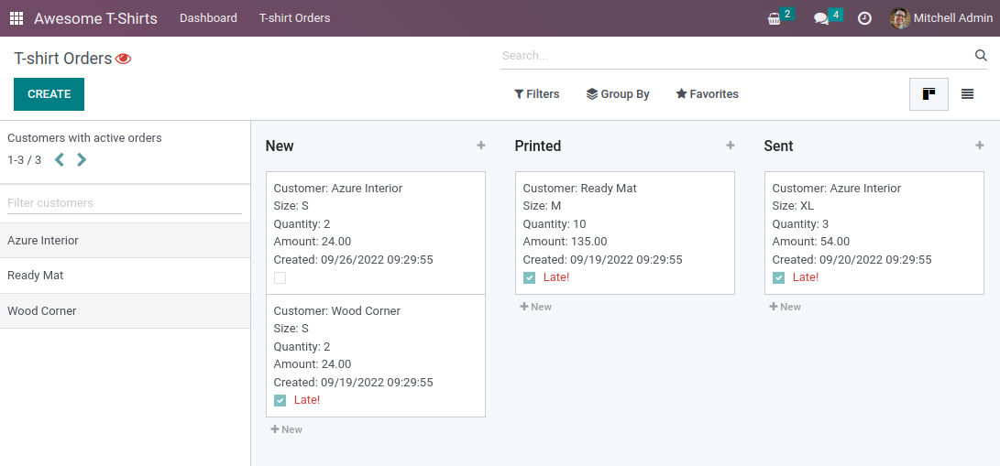
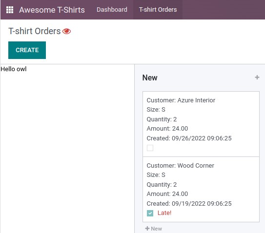
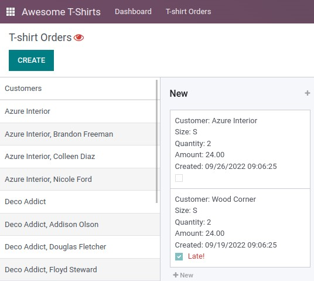
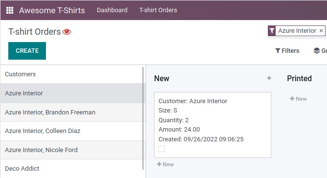
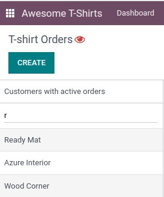
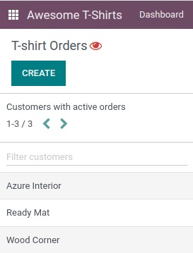

# Part 5: Custom Kanban View (hard)

This is a more complicated project that will showcase some non trivial aspects
of the framework. The goal is to practice composing views, coordinating various
aspects of the UI and doing it in a maintainable way.

Bafien had the greatest idea ever (after the freeze!): a mix of a Kanban View
and a list view would be perfect for your needs! In a nutshell, he wants a list
of customers on the left of the task kanban view. When you click on a customer
on the left sidebar, the kanban view on the right is filtered to only display orders
linked to that customer.



## 5.1 Create a new kanban view

Since we are customizing the kanban view, let us start by extending it and using
our extension in the kanban view for the tshirt orders

- extend the kanban view
- register it under the `awesome_tshirt.kanbanview_with_customers`
- use it in the `js_class`

## 5.2 Create a CustomerList component

We will need to display a list of customers, so we might as well create the
component.

- create a `CustomerList` component (which just display a div with some text for now)
- it should have a `selectCustomer` prop
- create a new template extending (xpath) the kanban controller template to add
  the `CustomerList` next to the kanban renderer, give it an empty function as `selectCustomer` for now
- subclass the kanban controller to add `CustomerList` in its sub components
- make sure you see your component in the kanban view

<details>
  <summary><b>Preview</b></summary>



</details>

## 5.3 Load and display data

- modify the `CustomerList` component to fetch a list of all customers in its willStart
- display it in the template in a `t-foreach`
- add an event handler on click
- whenever a customer is selected, call the `selectCustomer` function prop

<details>
  <summary><b>Preview</b></summary>



</details>

## 5.4 Update the main kanban view

- implement `selectCustomer` in the kanban controller to add the proper domain
- modify the template to give the real function to the CustomerList `selectCustomer` prop

Since it is not trivial to interact with the search view, here is a quick snippet to
help:

```js
selectCustomer(customer_id, customer_name) {
    this.env.searchModel.setDomainParts({
        customer: {
            domain: [["customer_id", "=", customer_id]],
            facetLabel: customer_name,
        },
    });
}
```

<details>
  <summary><b>Preview</b></summary>



</details>

## 5.5 Only display customers which have an active order

There is a `has_active_order` field on `res.partner`. Let us allow the user to
filter results on customers with an active order.

- add an input of type checkbox in the `CustomerList` component, with a label `Active customers` next to it
- changing the value of the checkbox should filter the list on customers with an
  active order

## 5.6 Add a search bar to Customer List

Add an input above the customer list that allows the user to enter a string and
to filter the displayed customers, according to their name. Note that you can
use the `fuzzyLookup` function to perform the filter.

<details>
  <summary><b>Preview</b></summary>



</details>

<details>
  <summary><b>Resources</b></summary>

- [code: fuzzylookup function](https://github.com/odoo/odoo/blob/cbdea4010ede6203f5f49d08d5a3bc44f2ff89e8/addons/web/static/src/core/utils/search.js#L43)
- [example: using fuzzyLookup](https://github.com/odoo/odoo/blob/cbdea4010ede6203f5f49d08d5a3bc44f2ff89e8/addons/web/static/tests/core/utils/search_test.js#L17)

</details>

## 5.7 Refactor the code to use `t-model`

To solve the previous two exercises, it is likely that you used an event listener
on the inputs. Let us see how we could do it in a more declarative way, with the
`t-model` directive.

- make sure you have a reactive object that represents the fact that the filter is active (so, something like `this.state = useState({ displayActiveCustomers: false, searchString: ''})`)
- modify the code to add a getter `displayedCustomers` which returns the currently
  active list of customers
- modify the template to use `t-model`

<details>
  <summary><b>Resources</b></summary>

- [owl: documentation on `t-model`](https://github.com/odoo/owl/blob/master/doc/reference/input_bindings.md)

</details>

## 5.8 Paginate customers!

- Add a `Pager` in the `CustomerList`, and only load/render the first 20 customers
- whenever the pager is changed, the customer list should update accordingly.

This is actually pretty hard, in particular in combination with the filtering
done in the previous exercise. There are many edge cases to take into account.

<details>
  <summary><b>Preview</b></summary>



</details>

<details>
  <summary><b>Resources</b></summary>

- [odoo: Pager](https://www.odoo.com/documentation/master/developer/reference/frontend/owl_components.html#pager)

</details>
