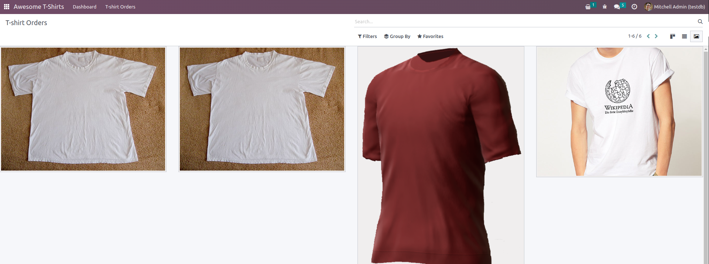
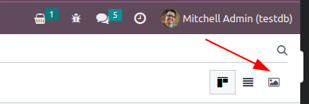
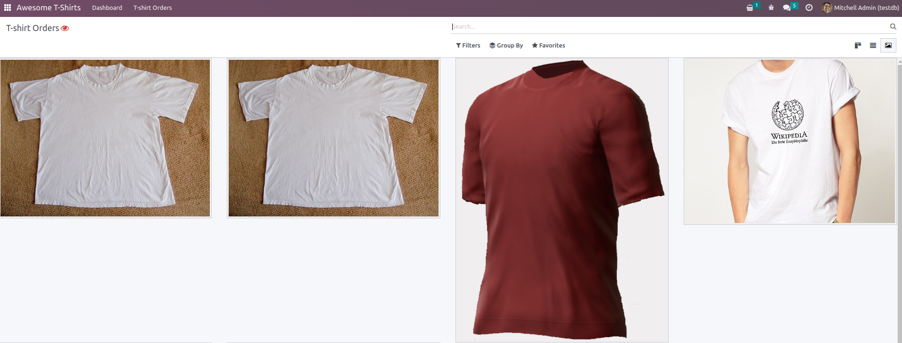
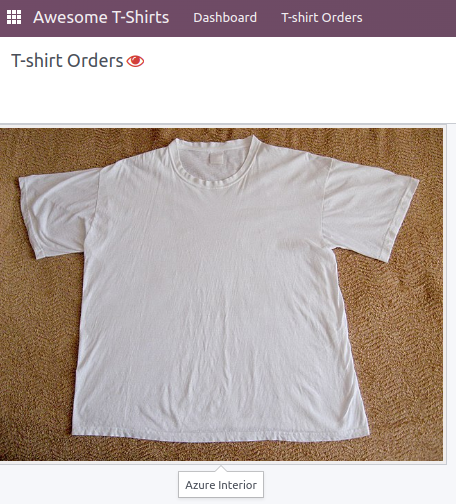

# Part 6: Making a view from scratch

Let us see how one can create a new view, completely from scratch. In a way, it
is not very difficult to do so, but there are no really good resources on how to
do it. Note that most situations should be solved by either a customized
existing view, or a client action.

For this exercise, let's assume that we want to create a `gallery` view, which is
a view that let us represent a set of records with a image field. In our
Awesome Tshirt scenario, we would like to be able to see a set of t-shirts images.

The problem could certainly be solved with a kanban view, but this means that it
is not possible to have in the same action our normal kanban view and the gallery
view.

Let us make a gallery view. Each gallery view will be defined by a `image_field`
attribute in its arch:

```xml
<gallery image_field="some_field"/>
```



## Setup

Simply install the `awesome_gallery` addon. It contains the few server files
necessary to add a new view.

## 6.1 Make a hello world view

First step is to create a javascript implementation with a simple component.

- create the `gallery_view.js`,`gallery_controller.js` and `gallery_controller.xml` files in `static/src`
- in `gallery_controller.js`, implement a simple hello world component
- in `gallery_view.js`, import the controller, create a view object, and register it
  in the view registry under the name `gallery`
- add `gallery` as one of the view type in the orders action
- make sure that you can see your hello world component when switching to the
  gallery view

<details>
  <summary><b>Preview</b></summary>




</details>

<details>
  <summary><b>Resources</b></summary>

- [notes on view architecture](notes_views.md)

</details>

## 6.2 Use the Layout component

So far, our gallery view does not look like a standard view. Let use the `Layout`
component to have the standard features like other views.

- import the `Layout` component and add it to the `components` of `GalleryController`
- update the template to use `Layout` (it needs a `display` prop, which can be found in `props.display`),

<details>
  <summary><b>Preview</b></summary>


</details>

## 6.3 Parse the arch

For now, our gallery view does not do much. Let's start by reading the information
contained in the arch of the view.

- create a `ArchParser` file and class, it can inherit from `XMLParser` in `@web/core/utils/xml`
- use it to read the `image_field` information,
- update the `gallery` view code to add it to the props received by the controller

Note that it is probably a little overkill to do it like that, since we basically
only need to read one attribute from the arch, but it is a design that is used by
every other odoo views, since it let us extract some upfront processing out of
the controller.

<details>
  <summary><b>Resources</b></summary>

- [example: graph arch parser](https://github.com/odoo/odoo/blob/master/addons/web/static/src/views/graph/graph_arch_parser.js)

</details>

## 6.4 Load some data

Let us now get some real data.

- add a `loadImages(domain) {...} ` method to the `GalleryController`. It should
  perform a `webSearchRead` call to fetch records corresponding to the domain,
  and use the `imageField` received in props
- modify the `setup` code to call that method in the `onWillStart` and `onWillUpdateProps`
  hooks
- modify the template to display the data inside the default slot of the `Layout` component

Note that the code loading data will be moved into a proper model in the next
exercise.

<details>
  <summary><b>Preview</b></summary>


</details>

## 6.5 Reorganize code

Real views are a little bit more organized. This may be overkill in this example,
but it is intended to learn how to structure code in Odoo. Also, this will scale
better with changing requirements.

- move all the model code in its own class: `GalleryModel`,
- move all the rendering code in a `GalleryRenderer` component
- adapt the `GalleryController` and the `gallery_view` to make it work

## 6.6 Display images

Update the renderer to display images in a nice way (if the field is set). If
the image_field is empty, display an empty box instead.

<details>
  <summary><b>Preview</b></summary>



</details>

## 6.7 Switch to form view on click

Update the renderer to react to a click on an image and switch to a form view

<details>
  <summary><b>Resources</b></summary>

- [code: switchView function](https://github.com/odoo/odoo/blob/master/addons/web/static/src/webclient/actions/action_service.js#L1329)

</details>

## 6.8 Add an optional tooltip

It is useful to have some additional information on mouse hover.

- update the code to allow an optional additional attribute on the arch:
  ```xml
    <gallery image_field="some_field" tooltip_field="some_other_field"/>
  ```
- on mouse hover, display the content of the tooltip field (note that it should
  work if the field is a char field, a number field or a many2one field)
- update the orders gallery view to add the customer as tooltip field.

<details>
  <summary><b>Preview</b></summary>



</details>

<details>
  <summary><b>Resources</b></summary>

- [code: tooltip hook](https://github.com/odoo/odoo/blob/master/addons/web/static/src/core/tooltip/tooltip_hook.js)

</details>

## 6.9 Add pagination

Let's add a pager on the control panel, and manage all the pagination like
a normal odoo view. Note that it is surprisingly difficult.

<details>
  <summary><b>Preview</b></summary>


</details>

<details>
  <summary><b>Resources</b></summary>

- [code: usePager hook](https://github.com/odoo/odoo/blob/master/addons/web/static/src/search/pager_hook.js)

</details>

## 6.10 Validating views

We have a nice and useful view so far. But in real life, we may have issue with
users incorrectly encoding the `arch` of their Gallery view: it is currently
only an unstructured piece of xml.

Let us add some validation! XML document in Odoo can be described with a rng
file (relax ng), and then validated.

- add a rng file that describes the current grammar:
  - a mandatory attribute `image_field`
  - an optional attribute: `tooltip_field`
- add some code to make sure all views are validated against this rng file
- while we are at it, let us make sure that `image_field` and `tooltip_field` are
  fields from the current model.

Since validating rng file is not trivial, here is a snippet to help:

```python
# -*- coding: utf-8 -*-
import logging
import os

from lxml import etree

from odoo.loglevels import ustr
from odoo.tools import misc, view_validation

_logger = logging.getLogger(__name__)

_viewname_validator = None

@view_validation.validate('viewname')
def schema_viewname(arch, **kwargs):
    """ Check the gallery view against its schema

    :type arch: etree._Element
    """
    global _viewname_validator

    if _viewname_validator is None:
        with misc.file_open(os.path.join('modulename', 'rng', 'viewname.rng')) as f:
            _viewname_validator = etree.RelaxNG(etree.parse(f))

    if _viewname_validator.validate(arch):
        return True

    for error in _viewname_validator.error_log:
        _logger.error(ustr(error))
    return False

```

<details>
  <summary><b>Resources</b></summary>

- [example: graph view rng file](https://github.com/odoo/odoo/blob/master/odoo/addons/base/rng/graph_view.rng)

</details>
